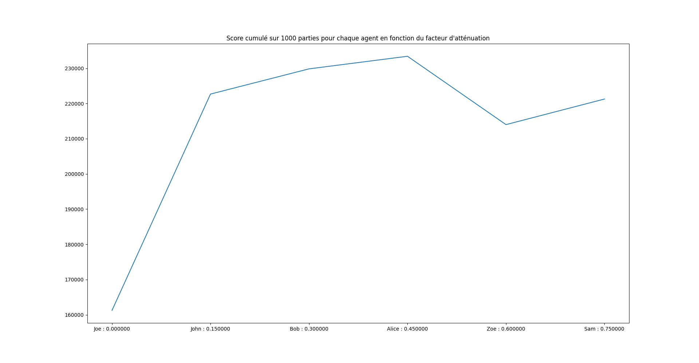
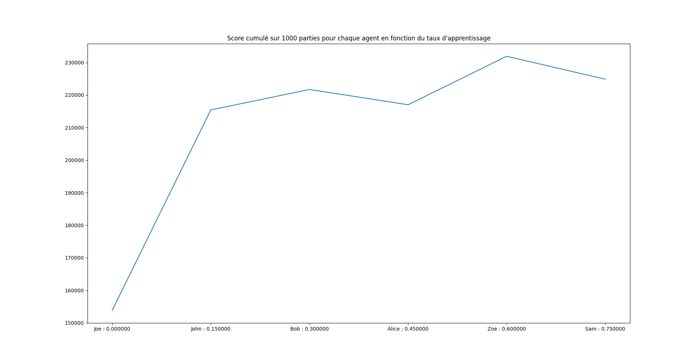
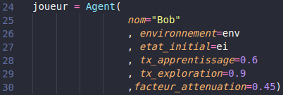

# Projet421
## Dépendances
Pour lancer le projet, il suffit d'avoir installer la bibliothèque **matplotlib**.  
Si cela n'est pas le cas, vous pouvez l'installer via pip avec la commande suiante : `pip install matplotlib`  
## Lancement  
Pour lancer le projet, il suffit de se situer à la racine du projet et de lancer la commande suiante : `python3 main.py`

## Modifications des paramètres  
Les paramètres tels que le facteur d'attenuation et le taux d'apprentissage de notre agent ont été fixés afin d'avoir la meilleure performance selon les tests que nous avons conduits :  
   
Si toutefois vous souhaitez modifier les paramètres de notre agent, vous pouvez le faire dans le fichier *main.py*, à la ligne 24 :  
 

## Organisation du code  
Notre algorithm est divisé en 4 objets :

- Un état est une combinaison de dé obtenue, à chaque état est associée une valeur qui correspond au nombre de point de la combinaison selon les règles du 421.  
- Une action est une décision prise après une combinaison obtenue.  
Nous avons cet ensemble d'actions possibles pour chaque lancé :  
  - Garder tous les dés  
  - Relancer 1 seul dé : Il y a une action possible pour chaque dé lancé (Si on a un 6-2-4, il y a une action “Relancer le 6”, une action “Relancer le 2”, et une action “Relancer le 4”)  
  - Relancer 2 dés : Pareil que l’item précédent, on a une action pour chaque couple de dés que l’on peut relancer.  
  - Relancer tous les dés.  
    A chaque action est affectée une valeur : 0 si l’on garde tous les dés, -1 si l’on relance. Cela permet de privilégier l’action de garder les dés, sachant que dans les règles du 421, les adversaires doivent faire un score supérieur ou égal au nôtre avec le même nombre de coup, garder ses dés peut donc être plus avantageux que de les relancer  
- Un mouvement est une transition entre 2 états. Ce n’est pas la même chose qu’une action qui est une décision. Dans le modèle probabiliste que nous avons créé, un mouvement possède une probabilité d’arriver comme passer de 4-2-2 à 4-2-1 avec 1 chance sur 6. Dans l’exemple ci-dessus, l’action serait de relancer un 2, pour cette action, on aurait 6 mouvements possibles :  
  - 4-2-2 -> 4-2-1
  - 4-2-2 -> 4-2-2
  - 4-2-2 -> 4-2-3
  - 4-2-2 -> 4-2-4
  - 4-2-2 -> 4-2-5
  - 4-2-2 -> 4-2-6  
Un mouvement est alors choisi au hasard selon les probabilités d’un lancer de dé. Et va modifier l’état courant du joueur
- Un agent représente le robot joueur. Il possède différents paramètres comme le taux d’apprentissage, le taux d’exploration ou le facteur d’atténuation.  
  
Nous avons donc découpé notre code en plusieurs fichiers : 1 fichier représentant 1 objet :

- [./Action.py](./Action.py) contient la classe permettant de créer des actions ainsi que les mouvements, qui sont des objets fortement connectés aux actions
- [./Etat.py](./Etat.py) contient la classe permettant de générer un état de façon très généraliste. Nous avons donc un autre fichier pour générer des états spécifiques au problème du 421 :  
- [./Etat421.py](./Etat421.py) contient la classe permettant de générer des états spécifiques au jeu du 421.
- [./Environnement.py](./Environnement.py) contient la classe permettant de créer un environnement. L'environnement possède uniquement la liste des actions possible pour un agent.
- [./Agent.py](./Agent.py) contient la classe permettant de créer un agent, avec toutes les méthodes pour prendre une décision (exploration, exploitation), de trouver la mailleure action à entreprendre, etc.
- [./main.py](./main.py) contient le code générant les états, les actions, et lançant les simulations 